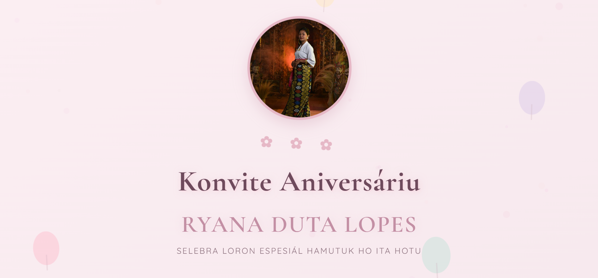
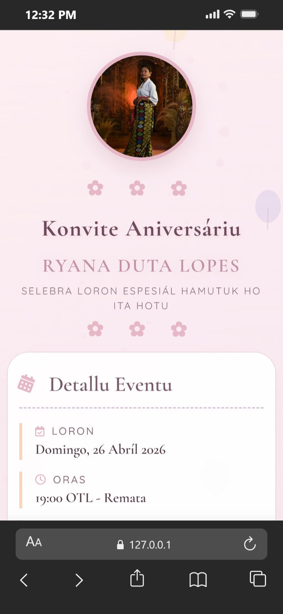

<div align="center">

# 🎂 Ryana Duta Lopes Birthday Invitation 🎂


### ✿ Elegant Birthday Invitation Website ✿

[](https://kitudoutel.github.io/birthday-invitation-website)
[](https://github.com/KituDoutel)
[](https://wa.me/67076309628)
[](LICENSE)

<br>

<p align="center">
  <b>🎉 Celebrate This Special Day Together! 🎉</b><br>
  <b>📅 April 27, 2026 • 7:00 PM</b><br>
  <b>📍 Suai Loro Beach, Timor-Leste</b><br>
  <b>💬 Confirm Your Attendance!</b>
</p>

</div>

---

## 📋 Project Information

<div align="center">

| | |
|:---:|:---|
| 🎯 **Client** | Ryana Duta Lopes |
| 💻 **Developer** | [**KituDoutel**](https://github.com/KituDoutel) |
| 📅 **Project Date** | April 2026 |
| 🎨 **Project Type** | Birthday Invitation Website |
| 💚 **Status** | ✅ Completed & Live |

</div>

---

## 🎨 Project Description

This birthday invitation website was created with love for **Ryana Duta Lopes** to celebrate her birthday at **Suai Loro Beach, Timor-Leste**.

**I (KituDoutel)** developed this website with:
- ✨ Elegant and feminine design
- 📱 Fully responsive for all devices
- 🎭 Modern and interactive animations
- 💬 WhatsApp integration for RSVP
- 🗺️ Integrated Google Maps

---

## 👤 Client Information

<div align="center">

| | |
|:---:|:---|
| **👑 Name** | Ryana Duta Lopes |
| **📅 Birthday** | April 27, 2026 |
| **📍 Location** | Suai Loro Beach, Timor-Leste |
| **💬 Contact** | [+670 7630 9628](https://wa.me/67076309628) |

</div>

---

## 🛠️ Technologies & Skills Used

<div align="center">

### 💪 Developer Skill Set


</div>

| Category | Technologies Used |
|----------|-------------------|
| **Frontend** | HTML5, CSS3, JavaScript (ES6+) |
| **Fonts** | Google Fonts (Cormorant Garamond, Quicksand) |
| **Icons** | Font Awesome 6 |
| **Animations** | AOS Library, CSS Keyframes |
| **Integration** | WhatsApp API, Google Maps Embed |
| **Deployment** | GitHub Pages |

---

## 🎯 Implemented Features

| ✅ Feature | 📝 Description |
|-----------|---------------|
| **Responsive Design** | Adapts to all screens (mobile, tablet, desktop) |
| **Countdown Timer** | Real-time countdown (days, hours, minutes, seconds) |
| **WhatsApp RSVP** | Direct confirmation via WhatsApp with formatted message |
| **Interactive Map** | Google Maps of Suai Loro Beach |
| **Particle Animation** | Floating particles in the background |
| **Confetti Effect** | Confetti appears on RSVP and when event arrives |
| **Floating Photo** | Client photo with floating effect |
| **Card Hover Effects** | Cards lift up on hover |
| **Text Shimmer** | Title with glow effect |
| **Animated Icons** | Icons with animations (spin, bounce, shake) |
| **Floating Balloons** | 5 pastel balloons floating in background |
| **Crown Animation** | Crown above photo with bounce effect |

---

## 📸 Project Screenshots

### 🖥️ Desktop View



> *Note: Full desktop screenshot will be updated soon*

### 📱 Mobile View



> *Note: Full mobile screenshot will be updated soon*

---

## 🚀 Live Demo

<div align="center">

### 🔗 [Click to View Live Website](https://kitudoutel.github.io/birthday-invitation-website)

*This website is hosted on **GitHub Pages** - Free Forever!*

</div>

---

## 📁 Project Structure

### File Descriptions:

| File | Description | Size |
|------|-------------|------|
| `index.html` | Main webpage structure | ~15 KB |
| `style.css` | All styling and animations | ~25 KB |
| `script.js` | Countdown, RSVP, particles, confetti | ~10 KB |
| `ryana.png` | Client profile photo | ~100 KB |

---

## 💼 Developer Portfolio

<div align="center">

### 👨‍💻 KituDoutel - Web Developer

| | |
|:---:|:---|
| **📍 Location** | Timor-Leste |
| **💻 Specialization** | Frontend Development, UI/UX Design |
| **🛠️ Skills** | HTML, CSS, JavaScript, Responsive Design |
| **🎯 Services** | Invitation Websites, Landing Pages, Personal Websites |

### 🔗 Contact & Portfolio

[](https://github.com/KituDoutel)
[](https://wa.me/yournumber)
[](mailto:your@email.com)

</div>

---

## 🌟 Services Offered

| 💼 Service | 📝 Description |
|------------|---------------|
| 🎂 **Invitation Websites** | Custom invitation websites for birthdays, weddings, etc. |
| 🏢 **Landing Pages** | Professional landing pages for businesses or events |
| 👤 **Personal Websites** | Online portfolios for individuals |
| 📱 **Responsive Design** | Websites that adapt to all devices |
| 🎨 **UI/UX Design** | Beautiful and user-friendly interface design |

---

## 📞 Interested in Similar Services?

<div align="center">

### 💚 Want a Custom Invitation Website Like This?

If you want a personalized invitation website like this for your special event, contact me!

[](https://wa.me/yournumber)
[](mailto:your@email.com)
[](https://github.com/KituDoutel)

</div>

---

## ✏️ How to Customize

### Change Event Details

Edit in `index.html`:
```html
<span class="detail-value" id="eventDateDisplay">Monday, April 27, 2026</span>
<span class="detail-value" id="eventTimeDisplay">19:00 - Until Finish</span>
<span class="detail-value" id="eventLocationDisplay">Suai Loro Beach, Suai, Timor-Leste</span>
